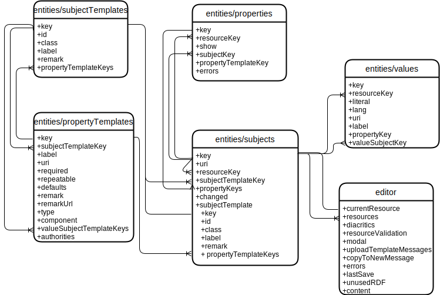

[](https://circleci.com/gh/LD4P/sinopia_editor)
[](https://codeclimate.com/github/LD4P/sinopia_editor/test_coverage)
[](https://codeclimate.com/github/LD4P/sinopia_editor/maintainability)
[](https://hub.docker.com/repository/docker/ld4p/sinopia_editor/tags?page=1&ordering=last_updated)


# Sinopia Linked Data Editor

Technical documentation specific to the Sinopia Linked Data Editor may also be found in the [wiki](https://github.com/LD4P/sinopia_editor/wiki/Sinopia-Editor). The Sinopia Editor homepage is available [development.sinopia.io](http://development.sinopia.io), [stage.sinopia.io](https://stage.sinopia.io), and [sinopia.io](https://sinopia.io). The Sinopia Editor is a React application with all new user interfaces and functionality using React and the React ecosystem. Portions of the codebase originally extracted from the Library of Congress [bfe project](https://github.com/lcnetdev/bfe).

## Installation

### Prerequisites

* [node.js](https://nodejs.org/en/download/) JavaScript runtime (>=14 is recommended)
* [npm](https://www.npmjs.com/) JavaScript package manager
* [Docker](https://www.docker.com/)
* A development cognito account: Go to https://development.sinopia.io/ and click "Request Account". This account can be used to authenticate when running locally as described below.

You can use the ["n"](https://www.npmjs.com/package/n) node package management to manage multiple version of node.

### Installation instructions

1.  Run `npm init`, and follow the instructions that appear.
2.  Get latest npm: `npm install -g npm@latest`
3.  Run `npm install`. This installs everything needed for the build to run successfully.
4.  Run `docker-compose pull` to pull down all images.
5.  Add these to your local `.env` file:

```
COGNITO_TEST_USER_NAME='sinopia-devs+client-tester@lists.stanford.edu' # a test user we have on dev and stage
COGNITO_TEST_USER_PASS='<get this from shared_configs or another developer>' # not committing the real value to a public repo
COGNITO_ADMIN_PASSWORD='<get this from shared_configs or another developer>'
DOCKER_AWS_ACCESS_KEY_ID='<get this from shared_configs or another developer>'
DOCKER_AWS_SECRET_ACCESS_KEY='<get this from shared_configs or another developer>'
```

## Running the application
To start all of the supporting services (ElasticSearch, API, etc.):
`docker-compose up -d`

Note that this will bring up the sinopia-editor app on port 8000, but it will NOT be in a mode where
you can make code changes and see them live.  To do this, start the Express web server (via `npm start`) and run the
application at [http://localhost:8888](http://localhost:8888):

`npm run dev-start`

This will run the app in development mode and code changes will immediately be loaded without having to restart the server.
Note that sinopia editor being run by docker on port 8000 will still be viewable but will not reflect any code changes you make
immediately, so be careful which port you are accessing the app at to avoid confusion.

Specify the environment variable `USE_FIXTURES=true` as shown below if you would like to use fixture resources and resource templates.
The fixtures are listed in `__tests__/testUtilities/fixtureLoaderHelper.js`. Fixture resource templates will be listed on the
templates list page and fixture resources can be searched on by entering the resource's URI in the Sinopia search box.

`USE_FIXTURES=true npm run dev-start`

## Developers

### Linters for JavaScript

There are two linters/formatters used in this project: eslint and prettier.
They can be run together or individually.

To run both:
`npm run lint`

To auto-fix errors in both (where possible):
`npm run fix`

To run just eslint:
`npm run eslint`

To automatically fix just eslint problems (where possible):
`npm run eslint-fix`

To run just prettier:
`npm run pretty`

To automatically fix just prettier problems (where possible):
`npm run pretty-fix`

### Unit, feature, and integration tests

Tests are written with jest and react-testing-library.

To run all of the tests:
`npm test`

To run a single test file (and see console messages):
`npx jest __tests__/actionCreators/resources.test.js`

To run a single test (and see console messages):
`npx jest __tests__/actionCreators/resources.test.js -t "newResourceFromN3 loading a resource dispatches actions"`

Or temporarily change the test description from `it("does something")` to `it.only("does something")` and run the single test file with `npx`.

#### Adding new test fixtures
If you have the docker environment running (and USE_FIXTURES env variable is false) you can use the `Load RDF tab`,
paste in the JSON-LD, set the base URI, and submitting will save the RT into your environment.

Otherwise, to use the static fixtures (USE_FIXTURES=true) add the fixture to the `__tests__/__template_fixtures__`
directory and update the `templateFilenames` constant in the `_tests_/testUtilities/fixtureLoaderHelper.js` with the
filename of the new test fixture.

If there is a resource template you would like to copy, you can go to the direct URI in the sinopia api
(e.g.  `https://api.development.sinopia.io/resource/ld4p:RT:bf2:Monograph:Work:Un-nested`) and copy everything returned
for the data list. Make sure you change (e.g.) `"@id": "https://api.development.sinopia.io/resource/ld4p:RT:bf2:Monograph:Work:Un-nested"` to
`"@id": "http://localhost:3000/resource/ld4p:RT:bf2:Monograph:Work:Un-nested"`

#### End-to-end tests

End-to-end tests are written with [Cypress](https://www.cypress.io/).

Add these to your local `cypress.env.json` file:
```
{
  "COGNITO_TEST_USER_NAME": "sinopia-devs_client-tester",
  "COGNITO_TEST_USER_PASS": "<get this from shared_configs or another developer>"
}
```

The end-to-end tests run against a complete environment running in docker, so it must be running as described above.

To open Cypress interactively (for test development), execute `npm run cypress-open` and click on the test to run.

To run test non-interactively, execute `npm run cypress-run`.

#### Cross Platform Testing

We use open source [](https://www.browserstack.com) accounts for cross-platform/browser testing. See the [Sinopia Editor wiki](https://github.com/LD4P/sinopia_editor/wiki/Cross-Platform-Browser-Testing) for more details about how to get an account.

#### Testing Honeybadger
To trigger a test exception, doubleclick "The underdrawing for the new world of linked data in libraries" on the home page.

### Monitoring ElasticSearch
DejaVu is available for monitoring local ElasticSearch.

To use DejaVu:
1. Uncomment the appropriate section in `docker-compose.yml`. (Do not commit this change.)
2. `docker-compose up -d`
3. Browse to http://localhost:1358.
4. When prompted, enter `http://localhost:9200` as the ElasticSearch URL and `*` as the index name.

### Monitoring Mongo
Mongo-Express is available for monitoring local Mongo.

To use Mongo-Express:
1. Uncomment the appropriate section in `docker-compose.yml`. (Do not commit this change.)
2. `docker-compose up -d`
3. Browse to http://localhost:8082.

### Release management (including weekly dependency update) instructions

See the [release process](/release_process.md) checklist.

#### Changes to environment variables

If you add environment variables to which the Editor needs to pay attention (e.g. for configuring connections to Cognito or other external services on a per-instance basis), you'll need to make sure they're added to lists in three places besides e.g. the `Config.js` function that uses the environment variable.
* the list given to `new webpack.EnvironmentPlugin()` in the `plugins` section of `webpack.config.js`
  * e.g. https://github.com/LD4P/sinopia_editor/commit/aadd9d6170b08ff9261392d5b2ec2c6f56470e20#diff-11e9f7f953edc64ba14b0cc350ae7b9dR58
* the build-time arguments section of `Dockerfile`
  * e.g. https://github.com/LD4P/sinopia_editor/commit/aadd9d6170b08ff9261392d5b2ec2c6f56470e20#diff-3254677a7917c6c01f55212f86c57fbfR10
* the env specific `docker build` commands in the `register_image` section of `.circleci/config.yml`
  * e.g. https://github.com/LD4P/sinopia_editor/commit/1d3e381cb0f937300242cf896f62c2508e4a57e2#diff-1d37e48f9ceff6d8030570cd36286a61R63

### Proxying to a different environment
Proxying allows using the Sinopia API and search from a different environment, rather than local instances.

To proxy to development:
1. Build the proxy image: `docker build -t proxy-apache2:latest -f Dockerfile.proxy .`
2. Start the proxy: `docker run --rm --name proxy-apache2 -p 8080:8080 -e ENV_HOSTNAME=development.sinopia.io proxy-apache2:latest`
3. Start the Sinopia Editor: `SINOPIA_API_BASE_URL=http://localhost:8080 SEARCH_HOST=http://localhost:8080 npm run dev-start`

Note that proxying to other environments may require additional Cognito configuration.

### Base Templates and https://sinopia.io/vocabulary

#### Base Templates

Conceptually, the Sinopia Editor uses JSON "resource templates" to inform the editor code which widgets (React "components") need to be displayed in order to create resource RDF according to said "resource template."

A "resource template" is comprised of one or more "property templates."  But the Sinopia Editor is _also used to create those JSON "property templates."_ Thus, there must be some initial JSON **base templates** to inform the editor code which widgets (React "components") need to be displayed in order to create the JSON corresponding to a valid property template.  A set of "start the world," "bootup templates", if you will.

#### Where do Base Template JSON Files Live?

**base templates** are in the `static/templates/` folder, and may themselves refer to files up a level in the `static/` folder.  The loading of the base templates is baked into the sinopia_editor code.

Reiterating: the UI widgets displayed for creating/editing a property template are driven by what is in the `static/` folder and its subfolders.  There is no additional deployment necessary.

#### Updates to https://sinopia.io/vocabulary

The sinopia_editor code displays the properties and classes prefixed "http://sinopia.io/vocabulary/" from a javascript object in `src/components/vocabulary/Vocab.js`.  If a new property is added to the Sinopia specific vocabulary (e.g. by adding to a base template), then that property should also be added to `src/components/vocabulary/Vocab.js`.  Changes to the documentation for these properties can be done as a pull request.

## State model



```
{
  subjects: {
    <subject key [nanoid]>: {<subject>},
    ...
  }
  properties: {
    <property key [nanoid]>: {<property>}
    ...
  }
  values: {
    <value key, [nanoid]>: {<values>}
    ...
  },
  subjectTemplates: {
    <subject template key [resource template id]>: {<subject template>}
    ...
  },
  propertyTemplates: {
    <property template key [resource template id > property uri]>: {<[property template]>}
    ...
  }
}
```

### Subject model
```
{
  key: <nanoid>
  uri: <uri|null>
  subjectTemplateKey: <key of subject template>,
  -> subjectTemplate: {subjectTemplate}
  propertyKeys: [key of property, ...]
  rootResourceKey: <key of root resource that this subject is descendant of; for root resource is own key>
  rootPropertyKey: <key of root property that this subject is part of; for root resource is null>
  descUriOrLiteralValueKeys = [key of descendant uri or literal Value, ...]
  descWithErrorPropertyKeys = [key of descendant property with an error, ...]
  valueSubjectOfKey: <if a nested subject, key of the value | null>
  -> properties: [{property}, ...]
  labels = [labels of property/resource templates of self and ancestors, ...]
  showNav: <true | false>
}
```
-> Added by selector, not stored in state.

The following are only in the resource subject (that is, the base subject).
```
{
  group: <group that that resource belongs to>,
  editGroups: [groups that can edit the resource],
  bfAdminMetadataRefs: [uri of referenced admin metadata resource, ...],
  bfWorkRefs: [uri of referenced Bibframe Work resource, ...],
  bfInstanceRefs: [uri of referenced Bibframe Instance resource, ...],
  bfItemRefs: [uri of referenced Bibframe Item resources, ...]
}
```

### Subject template model
```
{
  key: <resource template id, e.g., resourceTemplate:bf2:Monograph:Instance>,
  id: <resource template id, e.g., resourceTemplate:bf2:Monograph:Instance>,
  uri: <resource template uri, e.g. http://datastore/resource/resourceTemplate:bf2:Monograph:Instance>,
  class: <resource URI, e.g., http://id.loc.gov/ontologies/bibframe/Instance>,
  label: <resource label, e.g., "BIBFRAME Instance">,
  author: <author>,
  remark: <remark>,
  date: <date>,
  suppressible: <true | false>,
  propertyKeys: [key of property templates, ...],
  group: <group that that template belongs to>,
  editGroups: [groups that can edit the template],

}
```

### Property model
```
{
  key: <nanoid>,
  subjectKey: <key of subject>,
  -> subject: {<subject>}
  propertyTemplateKey: <key of property template>,
  -> propertyTemplate: {<propertyTemplate>},
  valueKeys: [key of value, ...] | null (if not expanded)
  -> values: [{value},...]
  show: <true | false>
  showNav: <true | false>
  rootResourceKey: <key of root resource that this property is descendant of>
  rootPropertyKey: <key of root property that this subject is part of; for root property is own key>
  descUriOrLiteralValueKeys = [key of descendant uri or literal Value, ...]
  descWithErrorPropertyKeys = [key of descendant or self Property with an error, ...]
  labels = [labels of property/resource templates of self and ancestors, ...]
  propertyUri: <property uri, e.g., "http://id.loc.gov/ontologies/bibframe/title - only when property is ordered">
}
```
-> Added by selector, not stored in state.

### Property template model
```
{
  key: <resource template id > property uris>,
  subjectTemplateKey: <key of subject template>,
  label: <label, e.g., "Title Information">,
  uris: {<property uri, e.g., "http://id.loc.gov/ontologies/bibframe/title">: <property uri label>}
  defaultUri: <a property uri used as default when creating a value>
  required: <true | false>
  repeatable: <true | false>
  ordered: <true | false>
  languageSuppressed: <true | false>
  immutable: <true | false> (property cannot be changed after resource has been saved)
  defaults: [{literal: <literal>, lang: <lang>}, {uri: <uri>, label: <label>},...]
  remark: <remark>,
  remarkUrl: <remark url, e.g., "http://access.rdatoolkit.org/2.13.html">
  remarkUrlLabel: <a descriptive label about the remark url, e.g., "Title Proper">
  type: <resource | uri | literal>,
  component: <InputLookup | InputLookupQA | InputList | InputLiteral | InputURI>,
  valueSubjectTemplateKeys: [<subject template keys>],
  authorities: [{authority}, ...],
  validationRegex: <regex for literal validation, as a string with backslashes double-escaped (e.g. "^\\d+$" becomes /^\d+$/)>,
  validationDataType: <uri for integer, dateTime, etc. for literal validation>
}
```

### Authority model
```
{
  uri: <authority uri>
  label: <label>
  authority: <authority, e.g., "geonames_ld4l_cache">
  subauthority: <subauthority, e.g., "area">
  nonldLookup: <true | false>
}
```

### Value model
```
{
  key: <nanoid>,
  propertyKey: <key of property>,
  -> property: {<property>},
  literal: <literal>,
  lang: <language for literal or URI label>,
  -> langLabel: <label for language>,
  uri: <uri>,
  label: <label for uri>,
  valueSubjectKey: <key for subject for a nested resource>,
  -> valueSubject: {<subject>}
  -> index: <1 based index of the value (relative to siblings)>
  rootResourceKey: <key of root resource that this property is descendant of>
  rootPropertyKey: <key of root property that this subject is part of>
  component: <InputLiteralValue | InputURIValue | InputLookupValue | InputListValue>,
  errors: [validation errors, ...]
  propertyUri: <property uri, e.g., "http://id.loc.gov/ontologies/bibframe/title - only when property is unordered">
}
```
-> Added by selector, not stored in state.

Note: A value will have literal / lang or uri / label or valueSubjectKey.

## Contributors

* [Jeremy Nelson](https://github.com/jermnelson)
* [Kevin Ford](https://github.com/kefo)
* [Kirk Hess](https://github.com/kirkhess)

[Index Data](http://indexdata.com/):
* [Charles Ledvina](https://github.com/cledvina)
* [Wayne Schneider](https://github.com/wafschneider)

## Maintainer

* **LD4P2 Sinopia Project Team**
  * [GitHub](https://github.com/ld4p/)


## License

Unless otherwise noted, code that is originally developed by Stanford University
in the `Sinopia Editor` is licensed under the [Apache 2](https://www.apache.org/licenses/LICENSE-2.0).

Original `bfe` code is in the [Public Domain](http://creativecommons.org/publicdomain/zero/1.0/).
